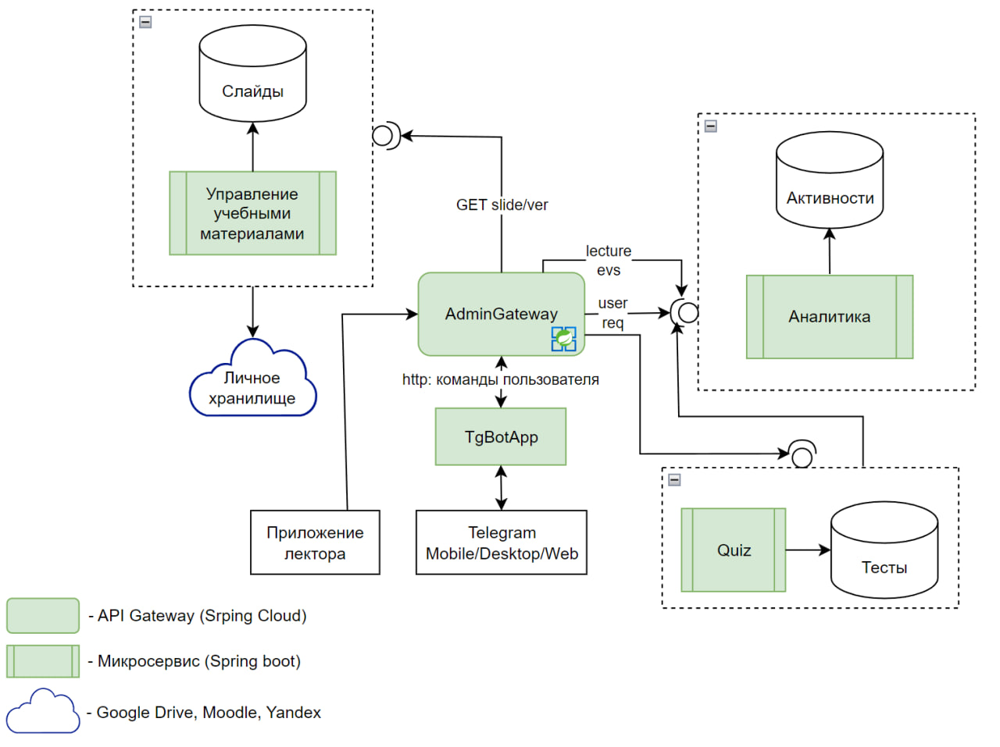

# Архитектура системы «Цифровой ассистент лектора»

Ниже представлена высокоуровневая схема взаимодействия микросервисов системы:



## Как запустить проект

Проект использует **Docker Compose** и для запуска всех микросервисов, Gateway и Базы Данных достаточно одной команды. 

### Шаг 1. Сборка микросервисов
Все сервисы написаны на Java 21 + Spring Boot 3 и используют Maven. Вы можете собрать их локально (опционально, так как Dockerfile сам их соберет при необходимости):
```bash
# В каждой директории сервиса (кроме postgres-init)
mvn clean package -DskipTests
```

### Шаг 2. Запуск через Docker Compose
Находясь в корне проекта, выполните:
```bash
docker-compose up -d --build
```
Эта команда остановит старые контейнеры, пересогберет новые образы, поднимет PostgreSQL-БД с `init.sql` (где создаются нужные таблицы и базы) и поднимет все 4 микросервиса + Gateway.

### Доступные сервисы:
- Единственная точка входа (API Gateway): `http://localhost:8080`
- Подробности работы с Gateway, маппингом портов и REST API вы найдете в [Services_API.md](./Services_API.md).
- Руководство для FrontEnd-разработчиков: [FRONTEND_GUIDE.md](./FRONTEND_GUIDE.md).

### Остановка проекта
Чтобы выключить все контейнеры:
```bash
docker-compose down
```